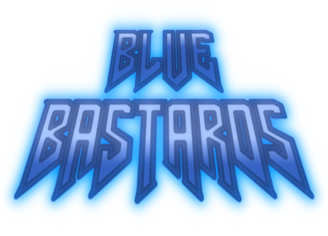

# 
A fast paced gameplay mod for UZDoom, inspired by the Metal Slug series, various boomer shooters and mods such as Russian Overkill, starring our awesome OCs Ace Deathshead and Spot blasting it out with shotguns, submachine guns, whiskey bottles, nukes and more! Both Spot and Ace have unique weapons to destroy the hellish demonic force who've done them wrong, so show them what REAL HELL looks like!

# Setup and Installation
NOTE: An IWAD (the game data for Doom, Doom 2, etc.) is required to play the mod, if you do not have those, you can play it with [Freedoom](https://freedoom.github.io/download.html) as well.
1.  Download the latest version of [UZDoom](https://zdoom.org/downloads) for your platform of your choosing.
2.  Download the stable release (COMING SOON!) from the releases tab, or for the latest features, click on the green button labeled Code, then click on download ZIP.
3.  With your IWADs present, drag the Blue Bastards ZIP file into UZDoom as you would with a regular PK3 file, pick your game, hit play and have fun!

You can also use a [launcher](https://doomwiki.org/wiki/Launcher) to make setup a bit easier.

# Feedback and Bug Reports
You can comment on the [Doomworld thread](https://www.doomworld.com/forum/topic/160249-uzdoom-blue-bastards-feedback-wanted/?tab=comments#comment-3063416) or make an issue to give us some feedback and/or report nasty bugs.

# Contributing
You can contribute by either giving us some feedback (see above), making an issue or making a pull request.
